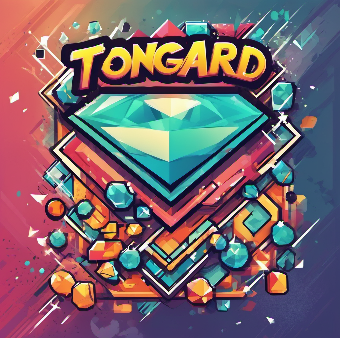

# Tongard - Telegram Mini App (FRONTEND) 🌟

  
  
  
  

## What is Tongard? 🤔
Tongard is a comprehensive open-source solution for building Telegram mini apps (TMA). Designed with modern web technologies, it aims to provide an easy and efficient way to create engaging mini apps for the Telegram platform.

## Example 😊
- **Telegram Example Bot**: [@tongardBot](https://t.me/tongardBot)
- **Telegram Chanel chat for questions**: [go to chanel](https://t.me/tongard_bot)

## Development Stack 🛠️

### Frontend
- **Framework**: Angular 18
- **UI Library**: Taiga UI

### Backend [backend part](https://github.com/tongard/tongard-tg-mini-app-backend)
- **Runtime**: Node.js (NestJS)
- **Database**: PostgreSQL
- **ORM**: Prisma
- **API**: REST API

### Features 🚀
#### Frontend
- **Telegram Web App**: Seamless integration with Telegram's web app environment.
- **User Authentication**: Secure user authentication using Telegram's data scope validation.
- **Farming TGNM**: An engaging farming system to earn TGNM tokens.
- **Task Completion**: Users can complete tasks to earn additional TGNM.
- **User Invitations**: Invite users and earn bonus TGNM for each successful referral.

#### Backend
- **RESTful API**: Robust API design for all backend operations.
- **Database Schema**: Well-defined database schema with PostgreSQL.
- **Migrations**: Smooth database migrations setup.
- **User Authorization**: JWT-based authorization ensuring secure user data handling.
- **Email Verification**: Send verification codes via email to validate users.
- **Admin Panel**: Manage and assign new tasks to users through an intuitive admin interface.
- **Environment Configuration**: Flexible `.env` configuration for different environments.

### DevOps ⚙️
- **Local Development**: Docker-compose setup for hassle-free local development.
- **Production Flow**: GitHub workflow scripts included for streamlined CI/CD pipelines.

### Internationalization 🌍
- **Languages**: Supports 8 languages - English, Spanish, Ukrainian, Arabic, Hindi, Portuguese, Russian, French.

## Roadmap 🛤️
### Upcoming Features
- **Multiplayer Game**: Add multiplayer games to engage users in real-time.
- **TON Wallet Integration**: Connect with TON wallet for seamless transactions.
- **TON Coin Contract**: Implement a contract for TON coin swaps.

## Contact 📬
- **Email**: [tongard.team@gmail.com](mailto:tongard.team@gmail.com)
- **Telegram**: [@tongard_development](https://t.me/tongard_development)

## Tags 🔖
`telegram mini app`, `tg mini app`, `tg web app`, `tma`, `twa`, `open source`, `angular`, `nestJS`, `docker`, `github actions`, `i18n`

---

Thank you for using Tongard! We hope you find it useful for your Telegram mini app development. Contributions and feedback are welcome! 😊
